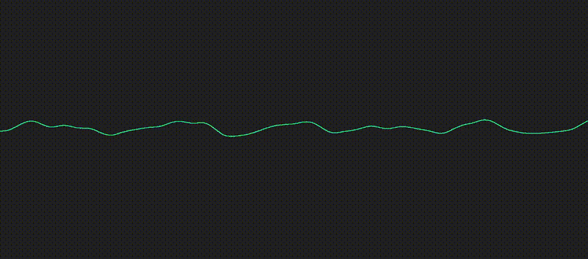
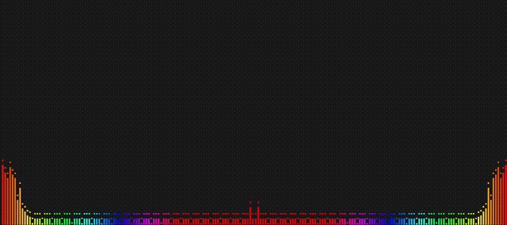

# Audio-Visualizer

Collection of audio visualizers made using p5.js

## Demo

### <a href="https://ronik22.github.io/Audio-Visualizer/examples/linear%20waveform%201/index.html">Linear waveform 1 ▶️</a>

### <a href="https://ronik22.github.io/Audio-Visualizer/examples/linear%20waveform%202/index.html">Linear waveform 2 ▶️</a>

### <a href="https://ronik22.github.io/Audio-Visualizer/examples/circular%20waveform%201/index.html">Circular waveform 1 ▶️</a>

### <a href="https://ronik22.github.io/Audio-Visualizer/examples/circular%20waveform%202/index.html">Circular waveform 2 ▶️</a>

### <a href="https://ronik22.github.io/Audio-Visualizer/examples/circular%20waveform%203/index.html">Circular waveform 3 ▶️</a>

### <a href="https://ronik22.github.io/Audio-Visualizer/examples/circular%20waveform%204/index.html">Circular waveform 4 ▶️</a>
